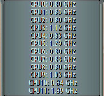

# gkrellm-gqfreq  

I loved this [GKrellM](http://gkrellm.srcbox.net/) plugin but the homepage is no longer online and i could not find a way to contact the original author.
Since the project was licensed under GPL2, i'm "adopting" and updating it.

Original gkfreq author: [Brad Davis](mailto:brad@peakunix.net)

